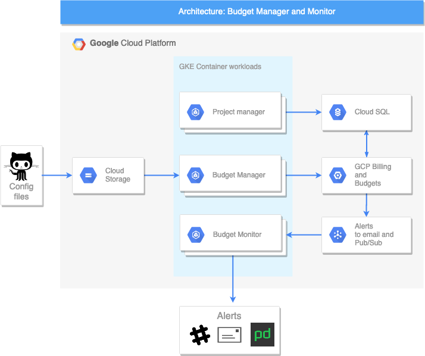

# plutus

GCP cost monitoring. Budget monitoring/alerting. Quota monitoring is a WIP

## Components:

Budget manager - Using yaml configuration, will GetAndUpdateOrCreate() budgets. Additional state is also saved in SQL.

Budget monitor - Pubsub consumer that will alert to various channels based on thresholds.

More to be added later (Project manager, Quota monitor, Billing manager, Quota manager)

# Configuration
See examples/sample_config.yaml for a layout example. Configuration is broken into subsections:

## projects
| Name | Description | Type | Default | Required |
|------|-------------|:----:|:-----:|:-----:|
| project\_id | GCP Project ID | string | n/a | yes |

## parent_folders
| Name | Description | Type | Default | Required |
|------|-------------|:----:|:-----:|:-----:|
| parent\_folder\_id | GCP Parent Folder ID (e.g. 1234567890123) | string | n/a | yes |

## labels
| Name | Description | Type | Default | Required |
|------|-------------|:----:|:-----:|:-----:|
| label\_list | List of kv pairs matching GCP project labels, one per line. E.g. 'environment': 'prod'. See example config.yaml for more details. | list | n/a | yes |

## default
WIP - not implemented in the first release.
No default specific parameters. Refer to common configuration options below.

## Common configuration options

These options will be configured for each subsection (projects, parent_folders, labels, default).

| Name | Description | Type | Default | Required |
|------|-------------|:----:|:-----:|:-----:|
| budget\_type | Either 'AMT' or 'LASTMONTH' | string | n/a | yes |
| budget\_amount | Threshold amount in USD | string | n/a | yes |
| products | GCP products to monitor. Currenlty only 'ALL' is supported | List(string) | 'ALL' | no |
| alert\_emails | Emails to send alerts to. This will be unioned with the owners on the GCP project | List(string) | n/a | no |
| threshold\_rules | Threshold budget rules. A list of objects containing 'threshold\_percent' and 'spend\_basis' keys/value pairs. Threshold percent describes when to send an email to GCP Billing admins (1.0 means 100% of the budget\_amount. Spend basis is either 'CURRENT_SPEND' or 'FORECASTED_SPEND' | List(object) | n/a | yes |
| include\_credits | Whether to include GCP credits towards the running budget total | bool | False | yes |
| pubsub | Whether to send budget alerts to pubsub. This will be used by the budget monitor to send alerts via email, slack, pagerduty  | bool | False | yes |
| pubsub\_topic | Format projects/PROJECTID/topics/TOPICNAME | string | projects/moz-fx-billing-projectid/topics/plutus-budget-notifications | no |

### Important notes: 
- Currently there is a bug with the budgets api updatebudget call where if you set Pubsub to True, and later to False, the API will not reflect this change.
- There is also another bug in the python resource manager client where listing projects by more than one label returns a union of projects rather than an intersection. So if using labels, restrict it to a single label until this is resolved.
